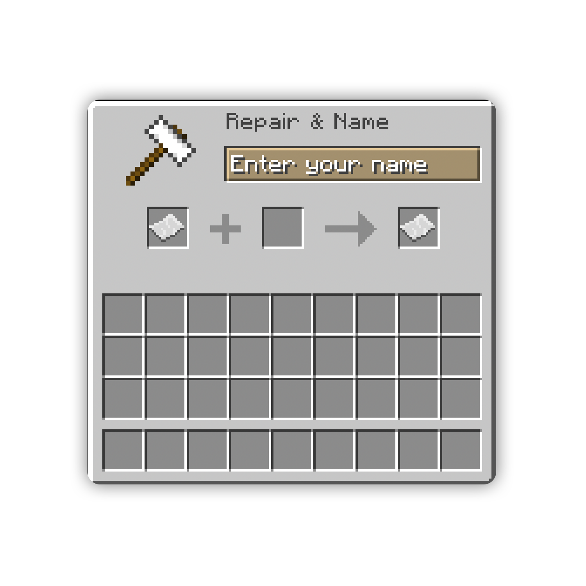
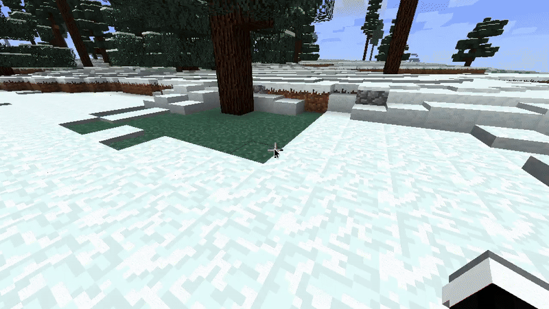
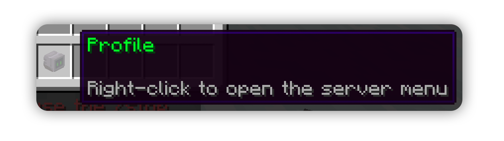
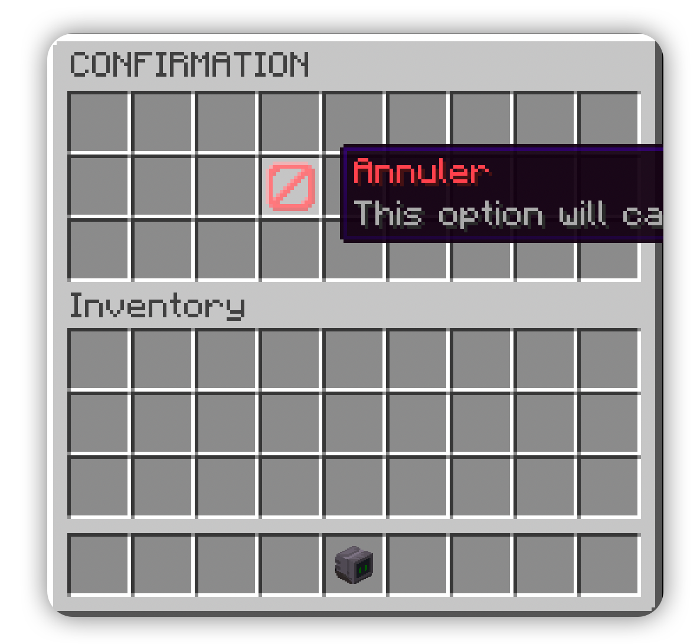

# Abstractify 🛠️


**A developer-friendly Minecraft plugin library for Spigot/Bukkit.**  
Create GUIs, chat prompts, signs, anvils, messages, and items with a clean, easy-to-use API.


---

## 🌟 Features

- **AbstractAnvil** – Open virtual anvil GUIs for player input (MC 1.8 → 1.20+).
- **AbstractSign** – Capture player input from sign GUIs easily.
- **AbstractChat** – Prompt players via chat input.
- **AbstractGUI** – Create custom inventories with clickable items.
- **AbstractItemStack** – Build items with custom names, lore, owners, and textures.
- **AbstractMessageBuilder** – Send formatted, centered, clickable messages.
- **Interactive messages** – Supports ClickEvents and HoverEvents.

---

## ⚡ Installation

1. Add the compiled JAR to your plugin's `libs` folder or server `plugins` folder.
2. Include it as a dependency in your project.
3. Ensure you have [ProtocolLib](https://www.spigotmc.org/resources/protocollib.1997/) installed.

---

## 📝 Example Usage

### 1️⃣ Prompt Player for a Name

```java
new AbstractAnvil(player, "Enter your name", (p, text) -> {
    p.sendMessage("You chose the name: " + text);
});
```

<p align="center">
  
</p>

### 2️⃣ Open a Sign for Input

```java
new AbstractSign(player, (p, lines, combinedLines) -> {
    p.sendMessage("You're searching for: " + combinedLines);
});
```
<br>

<p align="center">
  
</p>

### 3️⃣ Custom Chat Prompt

```java
new AbstractChat(player, "Enter your password:", (player, message) -> {
    player.sendMessage("Logging in...");
});
```

<br>

<p align="center">
  
</p>

<br>

### 4️⃣ Send Clickable Messages

```java
new AbstractMessageBuilder()
    .newLine()
    .addText("§6Don't forget to shop our holiday sales!")
    .newLine()
    .addInteractiveText("§6Visit our website", ClickEvent.Action.OPEN_URL, "https://example.com", "§aClick me!")
    .send(player);
```

<br>

<p align="center">
  
</p>

### 5️⃣ Create Custom Items

```java
AbstractItemStack profileItem = new AbstractItemStack(Material.SKULL_ITEM, "§aProfile");
profileItem.setOwner(player);
profileItem.setLore("", "§7Right-click to open the server menu");
player.getInventory().setItem(4, profileItem.build());
```

<p align="center">
  
</p>

### 6️⃣ Create a Custom GUI

```java
public class GuiExample extends AbstractGUI {

    public GuiExample(Player player) {
        super(player, "CONFIRMATION", null, 9 * 3);
    }

    @Override
    public void createItems(Player player, Inventory inventory) {

        AbstractItemStack cancelItem = new AbstractItemStack(Material.BARRIER, "§cAnnuler");
        cancelItem.setLore("§7This option will cancel your choice.");

        addItem(12, cancelItem.build(), (e) -> {
            player.sendMessage("§cAction cancelled.");
            close();
        });
    }
}
```

<p align="center">
  
</p>